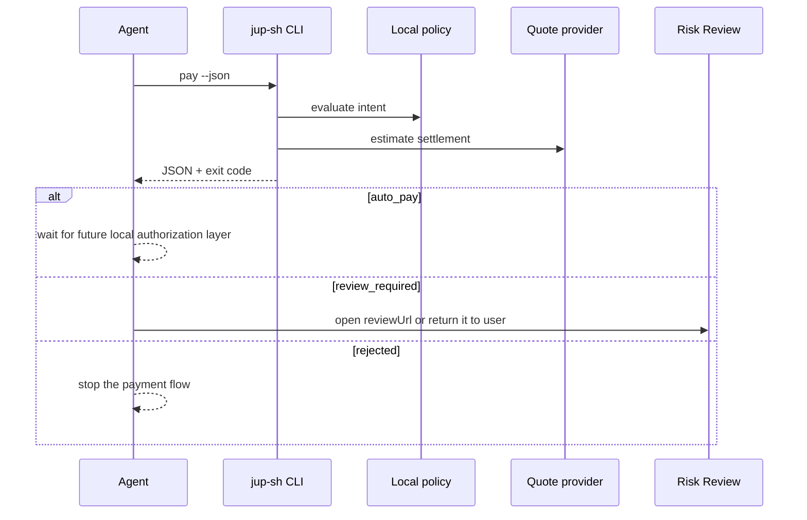

# Agent Integration

This guide describes the current safe integration pattern for agents and
scripts.

`jup.sh` is still an early alpha. It creates local payment intents, evaluates
local policy, estimates settlement, and returns a structured result. It does
not sign transactions, execute swaps, custody funds, or move tokens.

## Integration Model



The agent should not treat the CLI as a wallet. In the current alpha, the CLI
is a policy and settlement-intent layer.

## 1. Initialize A Local Workspace

```bash
npx jup-sh@alpha init
```

This writes:

```txt
jup.config.json
jup.policy.json
```

`jup.config.json` contains local defaults:

```json
{
  "reviewBaseUrl": "https://www.jup.sh",
  "policyPath": "jup.policy.json",
  "intentStore": ".jup-sh/intents",
  "quoteProvider": "mock"
}
```

`jup.policy.json` contains the risk controls:

```json
{
  "maxAutoSettleUSDC": 5,
  "maxAllowedSettleUSDC": 100,
  "maxPriceImpactBps": 100,
  "reviewHighPriceImpact": true,
  "verifiedTokens": ["USDC", "SOL", "JUP", "BONK"],
  "trustedRecipients": [],
  "reviewUnknownRecipients": true
}
```

Use `--force` only when you intentionally want to overwrite local files.

## 2. Call `pay --json`

Agents should use JSON mode and branch on the process exit code:

```bash
npx jup-sh@alpha pay --agent deepseek --token SOL --amount 20 --settle USDC --json
```

Exit codes:

| Exit code | Decision | Agent behavior |
| --- | --- | --- |
| `0` | `auto_pay` | Intent is inside policy and ready for future local authorization. |
| `2` | `review_required` | Return or open `reviewUrl`. This is a controlled outcome. |
| `1` | `rejected` or command failure | Stop the payment flow. |

## 3. Handle Review

When policy requires review, the JSON output includes:

```json
{
  "decision": "review_required",
  "nextAction": "open_review",
  "reviewUrl": "https://www.jup.sh/pay/intent_xxx"
}
```

The agent should return that URL to the user or open it in the surrounding app.
It should not bypass policy.

## 4. Export A Review Payload

Saved intents can be exported as a static Risk Review URL:

```bash
npx jup-sh@alpha intent export intent_xxx
```

The exported URL uses a fragment payload:

```txt
https://www.jup.sh/pay/intent_xxx#intent=<base64url-json-payload>
```

This lets a local CLI or SDK hand off review evidence without a jup.sh backend.

## Current Non-Goals

- No signing.
- No custody.
- No swap execution.
- No Solana Pay transaction request generation.
- No remote backend persistence.
- No authentication.

