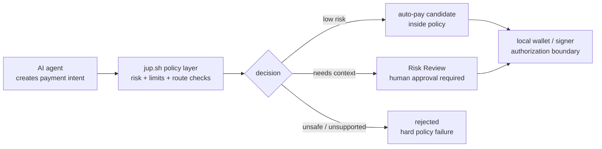
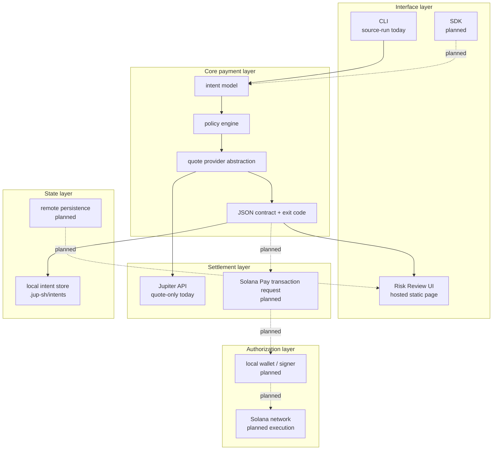
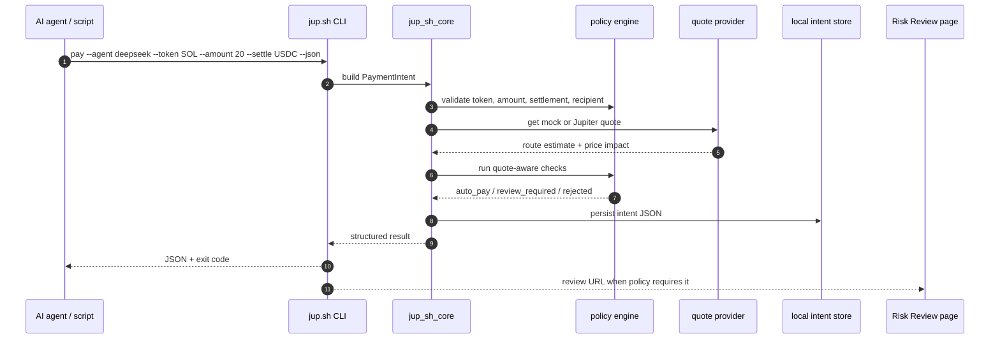
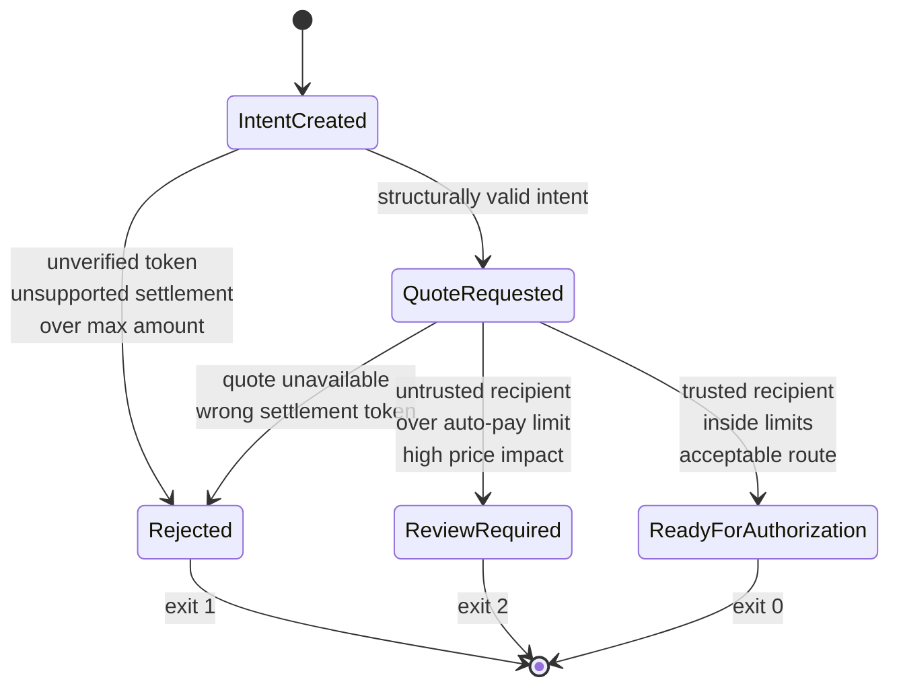
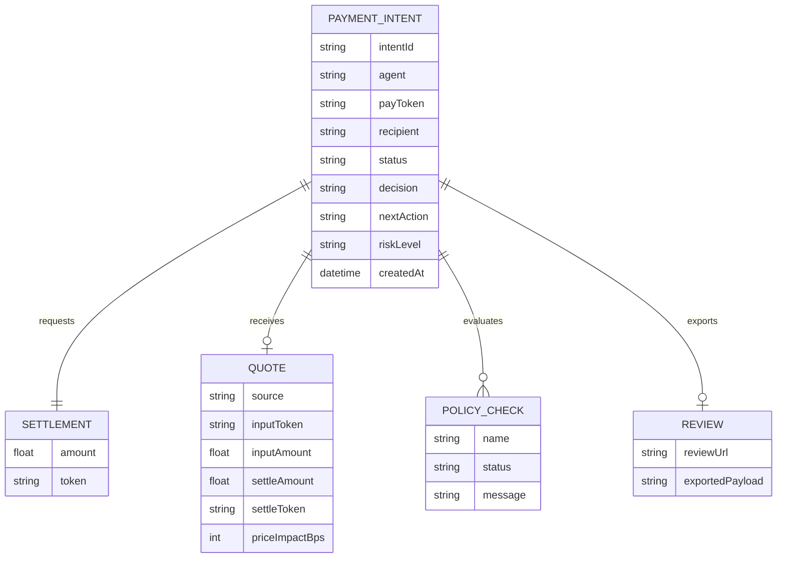
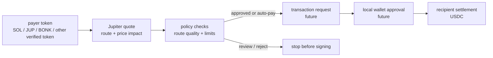
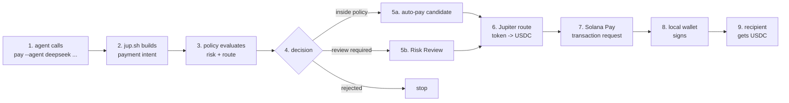

# Architecture

`jup.sh` is a risk and settlement layer for Solana agent payments.

The design goal is narrow: an agent can create a payment intent, but policy
decides whether that intent can continue automatically, must be reviewed by a
human, or should be rejected. Jupiter is used for token-to-USDC settlement. The
current alpha stops before signing or moving funds.

## Product Boundary

The most important boundary is between **intent creation** and **funds
authorization**.

Agents can request a payment. They do not directly control private keys, sign
transactions, or bypass policy. The user or local wallet remains the signing
boundary.

This boundary keeps the product from becoming "an agent wallet." `jup.sh`
should be a payment control layer: it receives structured intent, adds policy
and settlement context, then returns a deterministic next action.

## Layered Architecture

The system is split into five layers. The alpha currently implements the CLI,
core policy engine, quote abstraction, local intent store, and static Risk
Review rendering. The Solana transaction layer is intentionally future work.

This structure lets the CLI and SDK share the same core behavior. The interface
may change, but the policy result, JSON contract, and settlement assumptions
should remain stable.

## Current Alpha Runtime Flow

The alpha flow is source-run and local. It is useful because it validates the
contract an agent would actually consume: command input, structured output,
exit codes, policy checks, and a review URL when needed.

The alpha intentionally does **not** submit a swap, generate a real transaction
request, or ask a wallet to sign. That keeps the first milestone focused on the
agent contract and risk boundary.

## Policy Decision Model

Policy is not a single boolean. It should produce one of three decisions:

- `auto_pay`: intent is inside policy and can proceed to local authorization.
- `review_required`: intent is valid, but risk context requires a human.
- `rejected`: intent violates a hard rule and should not continue.

This is the core product hook. `jup.sh` becomes more valuable as the policy
layer gets richer: recipient trust, route quality, token verification,
behavioral limits, and eventually business-specific rules.

## Data Model

The current data model is intentionally small. It should remain explicit,
because agents and scripts need predictable fields.

The important design choice is that policy evidence is returned with the
decision. A caller should not receive only `review_required`; it should receive
the reasons and checks that made review necessary.

## Settlement Direction

Jupiter is the settlement primitive. The payer should be able to use any
verified token; the recipient should receive USDC.

Today this is quote-only. The CLI can ask Jupiter for route estimates and use
those estimates in policy checks. Future versions can use the same route
context to build a transaction request.

The settlement layer should never hide risk. Route quality, settlement token,
and price impact are policy inputs, not just execution details.

## Current Alpha Boundary

This table is deliberately strict. It keeps the project honest about what is
usable today and what is still design work.

| Area | Current alpha | Target direction |
| --- | --- | --- |
| CLI | Source-run Rust CLI | Published npm wrapper and stable CLI |
| Agent contract | JSON output and exit codes | SDK + CLI contract shared by agents |
| Policy | Deterministic local checks | Configurable policy profiles |
| Jupiter | Quote-only estimates | Transaction route construction |
| Risk Review | Static hosted page | Review workflow with durable state |
| Signing | Not implemented | Local wallet/user approval boundary |
| Settlement | Not executed | USDC settlement through Solana transaction |
| Storage | Local `.jup-sh/intents` | Optional remote persistence |

## Future End-to-End Flow

The target flow should still feel simple from the agent side. Complexity belongs
inside `jup.sh`: policy, risk evidence, route checks, review fallback, and
transaction request construction.

The product should stay command-first. UI exists to review risk and explain
policy decisions, not to become another manual payment dashboard.

## Engineering Principles

- Keep the agent interface boring: stable commands, stable JSON, stable exit
  codes.
- Keep signing local: agents create intents; users or local policy authorize
  funds.
- Treat policy output as product surface: every review decision needs evidence.
- Treat Jupiter route data as risk context, not only settlement plumbing.
- Ship in phases: quote-only contract first, then transaction request, then
  carefully scoped execution.
