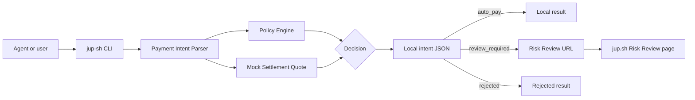
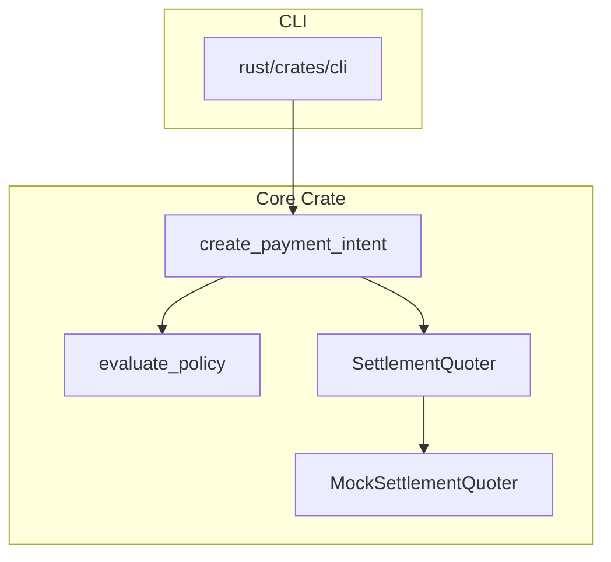

# jup.sh CLI Technical Design

Phase 1 turns the product narrative into a local command that agents and humans
can run.

The goal is intentionally narrow:

```txt
agent intent -> policy decision -> mock Jupiter settlement quote -> local intent record -> review URL
```

Phase 1 does not sign transactions, custody funds, submit swaps, or execute real
payments.

## 1. Product Goal

The CLI should make this command real:

```bash
jup-sh pay --agent claude --token SOL --settle 20 USDC
```

Expected result:

```json
{
  "intentId": "intent_...",
  "agent": "claude",
  "payToken": "SOL",
  "settlement": {
    "amount": 20,
    "token": "USDC"
  },
  "status": "review_required",
  "decision": "review_required",
  "nextAction": "open_review",
  "riskLevel": "medium",
  "reasons": [
    "recipient is not trusted",
    "settlement amount exceeds auto-pay limit of 5 USDC"
  ],
  "reviewUrl": "https://jup.sh/pay/intent_..."
}
```

This is the first working version of the jup.sh flow:

```txt
Agents pay with any verified token.
Recipients settle in USDC.
Policy decides when humans step in.
```

## 2. Non-Goals

Phase 1 does not include:

- Real Jupiter API integration.
- Real Solana Pay transaction request generation.
- Wallet signing.
- Token transfer or swap execution.
- Remote backend persistence.
- Authentication.
- A published npm package.

These are deliberately left for later phases.

## 3. System Design



The CLI owns command parsing and terminal output. The core crate owns the
reusable payment intent logic.



## 4. Command Interface

Primary command:

```bash
jup-sh pay --agent claude --token SOL --settle 20 USDC
```

Options:

| Option | Required | Description |
| --- | --- | --- |
| `--agent` | yes | Agent name, such as `claude`, `codex`, or `deepseek`. |
| `--token` | yes | Payer token symbol. Phase 1 supports verified mock symbols only. |
| `--settle` | yes | Settlement amount and token. Phase 1 supports USDC settlement. |
| `--recipient` | no | Recipient address or label. Unknown recipients trigger review by default. |
| `--reference` | no | External reference or memo. |
| `--json` | no | Print JSON only. |
| `--quote-provider` | no | `mock` by default. Use `jupiter` for quote-only real routing. |
| `--jupiter-quote-url` | no | Defaults to Jupiter Swap quote API. |
| `--jupiter-api-key` | no | Optional API key. Defaults to `JUPITER_API_KEY` when set. |
| `--slippage-bps` | no | Slippage tolerance for Jupiter quotes. Defaults to `50`. |
| `--review-base-url` | no | Defaults to `https://jup.sh`. |
| `--store` | no | Intent storage directory. Defaults to `.jup-sh/intents`. |

Show a saved intent:

```bash
jup-sh intent list
jup-sh intent list --json
jup-sh intent show intent_abc123
jup-sh intent show intent_abc123 --json
```

## 5. Rust Workspace

pay.sh is primarily implemented as a Rust workspace. jup.sh should follow the
same direction for CLI and payment logic.

Phase 1 structure:

```txt
rust/
  Cargo.toml
  crates/
    core/
      src/lib.rs
    cli/
      src/main.rs
```

The static website remains JavaScript. The CLI and reusable payment-intent logic
live in Rust.

## 6. Core Crate

The first core surface is minimal and internal:

```rust
use jup_sh_core::{create_payment_intent, CreatePaymentIntentInput};
```

### create_payment_intent

Input:

```rust
CreatePaymentIntentInput {
    agent: "claude".into(),
    pay_token: "SOL".into(),
    settle_amount: 20.0,
    settle_token: "USDC".into(),
    recipient: None,
    reference: None,
}
```

Output:

```rust
PaymentIntent {
    intent_id,
    agent,
    pay_token,
    settlement,
    quote,
    status,
    decision,
    next_action,
    risk_level,
    reasons,
    policy_checks,
    review_url,
    created_at,
}
```

### evaluate_policy

Phase 1 policy is deterministic and local.

Default policy:

```json
{
  "maxAutoSettleUSDC": 5,
  "maxAllowedSettleUSDC": 100,
  "verifiedTokens": ["USDC", "SOL", "JUP", "BONK"],
  "trustedRecipients": [],
  "reviewUnknownRecipients": true
}
```

Decision values:

| Decision | Meaning |
| --- | --- |
| `auto_pay` | The intent is inside policy. Later phases may proceed to wallet authorization. |
| `review_required` | The intent is valid, but requires human review before signing. |
| `rejected` | The intent is outside allowed policy. |

Intent status values:

| Status | Meaning |
| --- | --- |
| `ready_for_authorization` | Policy passed. The next step is local authorization in a future phase. |
| `review_required` | The intent is valid, but should be reviewed before signing. |
| `rejected` | The intent should not continue. |

Agent-facing action values:

| Next action | Meaning |
| --- | --- |
| `ready_for_authorization` | Policy passed. Later phases may continue to local wallet authorization. |
| `open_review` | Policy requires Risk Review before signing. |
| `rejected` | The intent should not continue. |

Risk levels:

| Risk level | Meaning |
| --- | --- |
| `low` | Policy passed. |
| `medium` | Valid payment, but review is required. |
| `high` | Rejected by policy. |

Policy checks are returned as structured entries:

```json
{
  "name": "recipient_trust",
  "status": "review",
  "message": "recipient is not trusted"
}
```

### quote_settlement

Phase 1 uses a `SettlementQuoter` boundary. The CLI uses `MockSettlementQuoter`
by default, which keeps local development and tests stable. It can also use a
quote-only `JupiterSettlementQuoter` through `--quote-provider jupiter`.

The boundary is intentionally small:

```rust
pub trait SettlementQuoter {
    fn quote_settlement(
        &self,
        input: &CreatePaymentIntentInput,
    ) -> Result<SettlementQuote, JupShError>;
}
```

Example:

```json
{
  "source": "mock_jupiter",
  "inputToken": "SOL",
  "inputAmount": 0.133333,
  "settleAmount": 20,
  "settleToken": "USDC",
  "priceImpactBps": 12
}
```

Current provider path:

```txt
MockSettlementQuoter by default
JupiterSettlementQuoter when explicitly requested
```

The intent and policy code does not need to change when the quote provider
changes.

Jupiter quote-only details live in `docs/jupiter-quote-design.md`.

## 7. Local Intent Store

The CLI saves every generated intent to:

```txt
.jup-sh/intents/<intent_id>.json
```

This keeps Phase 1 local while making the review URL's intent ID inspectable.

The CLI can read a saved intent:

```bash
jup-sh intent list
jup-sh intent show intent_abc123
```

`--store <dir>` can override the default intent directory for tests or custom
local workflows.

## 8. Local Policy File

The CLI may load `jup.policy.json` from the current working directory.

Example:

```json
{
  "maxAutoSettleUSDC": 10,
  "maxAllowedSettleUSDC": 250,
  "verifiedTokens": ["USDC", "SOL", "JUP", "BONK"],
  "trustedRecipients": ["jup-sh-demo"],
  "reviewUnknownRecipients": true
}
```

If no local file exists, the CLI uses the default policy.

## 9. Output Rules

Default output should be readable:

```txt
jup.sh payment intent

Intent: intent_...
Agent: claude
Pay with: SOL
Settle: 20 USDC
Decision: review_required
Next action: open_review
Risk: medium
Reason: recipient is not trusted
Policy checks:
- [pass] verified_token: SOL is verified
- [review] recipient_trust: recipient is not trusted
Review: https://jup.sh/pay/intent_...
Saved: .jup-sh/intents/intent_....json
```

`--json` prints only JSON for agent and script usage.

List output should stay compact:

```txt
jup.sh local payment intents

intent_...  claude  20 USDC  review_required  2026-05-08T...
```

## 10. Future Phases

Phase 2:

- Replace mock quote with Jupiter API quote.
- Persist intents in a small backend.
- Make Risk Review page load intent details by ID.

Phase 3:

- Generate Solana Pay transaction requests.
- Add wallet authorization.
- Add receipt and settlement status.

Phase 4:

- Publish npm package.
- Add MCP integration.
- Add richer risk policies and agent-specific spending limits.
