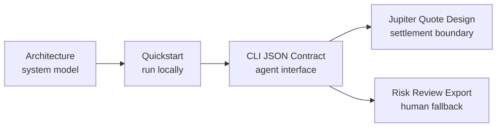

# jup.sh Docs

Risk and settlement for Solana agent payments.

`jup.sh` is an early source-run developer alpha for agent-native payments on
Solana.

```txt
Agents pay with any verified token.
Recipients settle in USDC.
Policy decides when humans step in.
```

## Read This First

The docs are organized around the current engineering boundary:



Recommended order:

1. [Architecture](architecture.md) - system boundary, diagrams, data model.
2. [Quickstart](quickstart.md) - run the alpha locally.
3. [CLI JSON Contract](cli-json-contract.md) - agent-facing output and exit codes.
4. [Jupiter Quote-Only Design](jupiter-quote-design.md) - token-to-USDC quote boundary.
5. [Risk Review Export Design](risk-review-export-design.md) - static review URL model.
6. [SDK Technical Design](sdk-technical-design.md) - first TypeScript SDK surface.

## Current Alpha

The first milestone is `v0.1.0-alpha.0`.

It includes:

- source-run Rust CLI;
- local policy checks;
- mock settlement quotes;
- optional Jupiter quote-only settlement estimates;
- local intent storage;
- Risk Review URL export;
- hosted static Risk Review rendering;
- an agent-facing JSON contract;
- release checks for the alpha package shape.

It does not include:

- wallet signing;
- swap execution;
- custody;
- Solana Pay transaction request generation;
- remote backend persistence;
- a published npm package.

## Core Command

```bash
pay --agent deepseek --token SOL --amount 20 --settle USDC
```

In source-run form:

```bash
npm run cli:alpha -- pay --agent deepseek --token SOL --amount 20 --settle USDC
```

## Product Boundary

`jup.sh` is an independent community-built tool and is not affiliated with
Jupiter.

The current integration direction is Jupiter-powered settlement and
policy-driven risk management. In this alpha, Jupiter integration is quote-only
and does not execute swaps.
