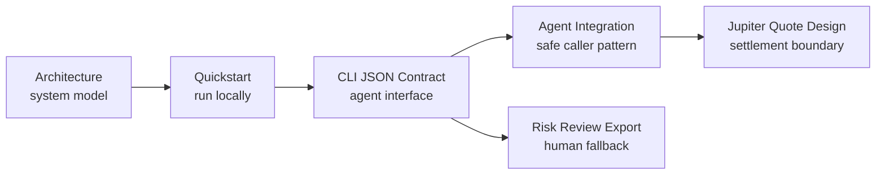

# jup.sh Docs

Risk and settlement for Solana agent payments.

`jup.sh` is an early developer alpha for agent-native payments on Solana.

The npm alpha is live:

```bash
npx jup-sh@alpha
```

```txt
Agents pay with any verified token.
Recipients settle in USDC.
Policy decides when humans step in.
```

## 3-Minute Integration

Install nothing globally. Start with `npx`:

```bash
npx jup-sh@alpha init
```

Check the local workspace:

```bash
npx jup-sh@alpha doctor
```

Trust a known API or vendor recipient:

```bash
npx jup-sh@alpha policy trust api.vendor.example
```

Create an agent payment intent:

```bash
npx jup-sh@alpha pay --agent deepseek --token SOL --amount 6 --settle USDC --recipient api.vendor.example --json
```

The output is a structured local payment intent. Agents should branch on:

| Exit code | Decision | Meaning |
| --- | --- | --- |
| `0` | `auto_pay` | Inside local policy and ready for future authorization. |
| `2` | `review_required` | Return or open the Risk Review URL. |
| `1` | `rejected` | Stop the payment flow. |

Current alpha boundary:

```txt
No signing. No custody. No swap execution.
```

The fastest path after this page is [Agent Integration](agent-integration.md).

## Read This First

The docs are organized around the current engineering boundary:



Recommended order:

1. [Architecture](architecture.md) - system boundary, diagrams, data model.
2. [Quickstart](quickstart.md) - run the alpha locally.
3. [CLI JSON Contract](cli-json-contract.md) - agent-facing output and exit codes.
4. [Agent Integration](agent-integration.md) - safe caller pattern for agents.
5. [Jupiter Quote-Only Design](jupiter-quote-design.md) - token-to-USDC quote boundary.
6. [Risk Review Export Design](risk-review-export-design.md) - static review URL model.
7. [SDK Technical Design](sdk-technical-design.md) - first TypeScript SDK surface.
8. [0.1.0-alpha.1](releases/0.1.0-alpha.1.md) - SDK risk-layer checkpoint.
9. [0.1.0-alpha.2](releases/0.1.0-alpha.2.md) - npm alpha checkpoint.
10. [0.1.0-alpha.3](releases/0.1.0-alpha.3.md) - CLI init checkpoint.
11. [0.1.0-alpha.4](releases/0.1.0-alpha.4.md) - policy tuning checkpoint.
12. [0.1.0-alpha.5](releases/0.1.0-alpha.5.md) - review shortcut checkpoint.
13. [0.1.0-alpha.6](releases/0.1.0-alpha.6.md) - doctor checkpoint.

## Current Alpha

The current checkpoint is `v0.1.0-alpha.6`.

The first milestone, `v0.1.0-alpha.0`, established the source-run CLI, JSON
contract, local policy checks, Jupiter quote-only estimates, local intent
storage, and static Risk Review export.

The alpha.1 checkpoint focuses on the SDK risk layer and Risk Review
explainability. The alpha.2 checkpoint adds the first public npm alpha package.
The alpha.3 checkpoint adds the first-run `jup-sh init` workflow.
The alpha.4 checkpoint adds local policy tuning commands.
The alpha.5 checkpoint adds a top-level `jup-sh review` shortcut.
The alpha.6 checkpoint adds local workspace diagnostics with `jup-sh doctor`.

It includes:

- public npm alpha CLI;
- source-run Rust CLI for development;
- local policy checks;
- mock settlement quotes;
- optional Jupiter quote-only settlement estimates;
- local intent storage;
- local workspace initialization with `jup-sh init`;
- local policy tuning with `policy trust`, `policy untrust`, and `policy set`;
- Risk Review URL export;
- top-level Risk Review URL shortcut with `jup-sh review`;
- local workspace diagnostics with `jup-sh doctor`;
- hosted static Risk Review rendering;
- source-only TypeScript SDK helpers for payment intents, Jupiter quote-only
  estimates, and Risk Review URL export;
- SDK policy profiles for sandbox, balanced, and strict risk posture;
- SDK trusted-recipient helper for known API/vendor destinations;
- SDK policy decision explanations for Risk Review and agent logs;
- hosted Risk Review page policy explanations before raw policy evidence;
- an agent-facing JSON contract;
- a public `jup-sh` npm alpha package;
- release checks for the alpha package shape.

It does not include:

- wallet signing;
- swap execution;
- custody;
- Solana Pay transaction request generation;
- remote backend persistence;
- a published SDK package.

## Core Command

```bash
pay --agent deepseek --token SOL --amount 20 --settle USDC
```

In source-run form:

```bash
npm run cli:alpha -- pay --agent deepseek --token SOL --amount 20 --settle USDC
```

With the npm alpha:

```bash
npx jup-sh@alpha pay --agent deepseek --token SOL --amount 20 --settle USDC
```

## Product Boundary

`jup.sh` is an independent community-built tool and is not affiliated with
Jupiter.

The current integration direction is Jupiter-powered settlement and
policy-driven risk management. In this alpha, Jupiter integration is quote-only
and does not execute swaps.
