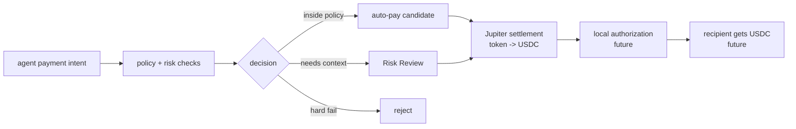
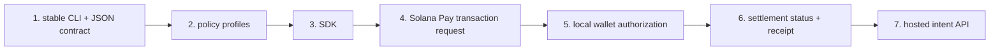

# Product Document

`jup.sh` is a Jupiter-powered risk and settlement layer for Solana agent
payments.

```txt
Agents pay with any verified token.
Recipients settle in USDC.
Policy decides when humans step in.
```

The product is intentionally early. The current version is a public website,
developer docs, public npm alpha CLI, and source-only SDK prototype. It is not
a production payment system.

## Positioning

The shortest useful positioning:

```txt
Risk and settlement for Solana agent payments.
```

The fuller version:

```txt
jup.sh is a Jupiter-powered risk and settlement layer for Solana agent payments.
Agents can pay with any verified token, recipients settle in USDC, and policy
decides when human review is required.
```

The two product handles are:

- Jupiter-powered settlement;
- policy-driven risk management.

This should not be framed as a wallet, a trading UI, or a manual payment-link
tool. Payment links are only the review fallback surface.

## Product Model



The default product path should be automatic. Human review appears only when
policy or risk signals require it.

## Current V1 Surface

Current public surface:

- website at `https://www.jup.sh`;
- GitHub repo at `https://github.com/jerrywang33/jup-sh`;
- GitHub Pages docs at `https://jerrywang33.github.io/jup-sh/`;
- public npm alpha package: `jup-sh`;
- source-run Rust CLI for development;
- static Risk Review page;
- Cloudflare Pages deployment.

Current homepage command:

```bash
pay --agent deepseek --token SOL --amount 20 --settle USDC
```

The homepage communicates the target stack:

- agents: Claude, Codex, DeepSeek, Kimi, MiniMax, Qwen;
- powered by: Jupiter API and Solana;
- ecosystem signals: Qwen, Claude, Codex, Jupiter, Solana, DeepSeek, AWS,
  Google Cloud, GitHub.

## Current Alpha Capabilities

The npm alpha implements:

- local workspace initialization with `jup-sh init`;
- local payment intent creation;
- deterministic policy checks;
- local policy tuning through `policy trust`, `policy untrust`, and
  `policy set`;
- mock settlement quote provider;
- optional Jupiter quote-only estimates;
- quote-aware risk checks;
- local policy inspection and initialization;
- local intent persistence under `.jup-sh/intents`;
- Risk Review URL export through `intent export`;
- top-level Risk Review shortcut through `jup-sh review`;
- `intent list` and `intent show`;
- agent-facing JSON output;
- CLI exit code contract;
- release gate and smoke tests.

## Current Non-Goals

The alpha does not implement:

- wallet signing;
- swap execution;
- custody;
- real payment settlement;
- Solana Pay transaction request generation;
- durable backend persistence;
- authentication;
- published npm package distribution.

These are not accidental gaps. They are boundaries that keep the first
milestone focused on agent intent, policy, and review.

## Policy As The First Risk Engine

The first useful risk module is policy, not an opaque AI model.

Example checks:

- token is verified;
- settlement token is USDC;
- amount is below hard limits;
- amount is below auto-pay limits;
- recipient is trusted or requires review;
- Jupiter quote is available;
- settlement token from quote matches the intent;
- price impact is acceptable.

Policy returns one of three outcomes:

| Outcome | Meaning |
| --- | --- |
| `auto_pay` | Valid and inside policy. |
| `review_required` | Valid, but needs human context. |
| `rejected` | Violates a hard rule. |

This is the moat direction: the richer the policy and risk layer becomes, the
more valuable `jup.sh` is as infrastructure rather than a thin UI.

Policy profiles turn that risk layer into a product surface:

| Profile | Role |
| --- | --- |
| `sandbox` | Agent demos, hackathons, and local testing with fewer review interruptions. |
| `balanced` | Known agents paying known APIs. This is the default alpha posture. |
| `strict` | New agents, unknown recipients, or higher-risk environments. |

The profile names matter because developers should not need to understand every
policy field before they can try the product.

Trusted recipients are the next simple risk primitive. They let a policy say:
this vendor/API is known, so a small payment can stay on the automatic path;
unknown recipients still go to Risk Review.

Explainability is part of the same risk layer. A decision should not only say
`review_required`; it should explain which checks passed, which factors caused
review, and what the caller should do next. This matters for agent logs, human
review, and future audit trails.

The hosted Risk Review page should use the same explanation model. It should
lead with a short summary, risk factors, recommended action, and passed checks,
then show the raw policy checks as evidence.

## Risk Review Role

Risk Review is not the primary product. It is the fallback for flagged intents.

It should show:

- agent name;
- payer token;
- USDC settlement amount;
- recipient;
- quote and route context;
- policy decision;
- review reasons;
- policy check evidence;
- approve or reject action in future phases.

In the current alpha, the review page renders static intent data. Future
versions should persist review decisions through an API.

## Phase Direction

The next product milestones should be sequenced:



Recommended next phase:

```txt
Build a working CLI/SDK payment primitive with policy-gated Auto Pay,
Risk Review fallback, Solana Pay transaction requests, and Jupiter
token-to-USDC settlement.
```

The first credible end-to-end path:

1. Agent calls `pay --agent deepseek --token SOL --amount 20 --settle USDC`.
2. `jup.sh` creates a payment intent.
3. Policy evaluates amount, token, recipient, and configured limits.
4. Jupiter quote estimates token-to-USDC settlement.
5. Quote-aware policy checks route risk.
6. Clean payment continues to local authorization.
7. Flagged payment opens Risk Review.
8. Future transaction request settles USDC to the recipient.

## Target API Shape

Future hosted API:

```txt
POST /api/intents
GET  /api/intents/:id
POST /api/intents/:id/risk
POST /api/intents/:id/quote
POST /api/intents/:id/transaction
GET  /pay/:id
GET  /api/intents/:id/status
```

The API and review URL should represent the same object: a payment intent.
Risk Review should only appear when policy requires human inspection.

## Brand Boundary

`jup.sh` is an independent community-built tool.

It may say Jupiter-powered only in the sense that it uses Jupiter API/routing
for token-to-USDC settlement. Do not imply official affiliation, partnership,
endorsement, or acquisition.

## Safety Rules

- No custody of user funds.
- No hidden routes.
- No blind signing.
- No agent-controlled private keys.
- Explicit policy limits.
- Verified or trusted token inputs.
- Review evidence for every flagged payment.
- Conservative rollout before money movement.
