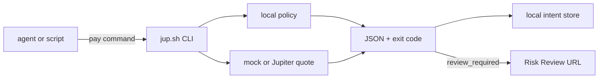

# Quickstart

This guide runs the current `jup.sh` alpha from source.

The alpha is useful for testing the agent-facing payment contract:

```txt
agent intent -> policy decision -> quote estimate -> local intent -> review URL
```

It does not sign transactions, execute swaps, custody funds, or move tokens.

## Prerequisites

You need:

- Node.js and npm;
- a working Rust toolchain;
- git.

Clone and install:

```bash
git clone https://github.com/jerrywang33/jup-sh.git
cd jup-sh
npm install
```

The npm wrapper is local and private in this alpha. Use `npm run cli:alpha --`
for the developer-facing command, or `npm run cli --` to run the Rust CLI
directly through Cargo.

## Command Flow



The CLI always creates a local intent record when the command is valid enough
to evaluate. The policy decision controls what the caller should do next.

## 1. Inspect The Default Policy

```bash
npm run cli:alpha -- policy show
```

The default policy is conservative:

- verified tokens only;
- USDC settlement only;
- auto-pay limit of 5 USDC;
- hard max of 100 USDC;
- unknown recipients require review;
- high price impact requires review.

Create a local policy file:

```bash
npm run cli:alpha -- policy init
```

This writes:

```txt
jup.policy.json
```

Use `--force` if you intentionally want to overwrite it.

## 2. Create A Payment Intent

```bash
npm run cli:alpha -- pay --agent deepseek --token SOL --amount 20 --settle USDC
```

This creates a local payment intent and saves it under:

```txt
.jup-sh/intents/<intent_id>.json
```

By default, the command uses the mock quote provider. That makes tests stable
and does not call external APIs.

## 3. Use JSON Mode For Agents

Agents and scripts should use `--json`:

```bash
npm run --silent cli:alpha -- pay \
  --agent deepseek \
  --token SOL \
  --amount 20 \
  --settle USDC \
  --json
```

`--json` prints one structured object to stdout. Agents should branch on the
exit code and `nextAction`.

| Exit code | Decision | Agent behavior |
| --- | --- | --- |
| `0` | `auto_pay` | Intent is inside policy and ready for local authorization in a future phase. |
| `2` | `review_required` | Open or return the Risk Review URL. This is a controlled policy outcome. |
| `1` | `rejected` or command failure | Stop the payment flow. |

The field-level contract is documented in
[CLI JSON Contract](cli-json-contract.md).

## 4. Test The Three Policy Outcomes

Auto-pay candidate with a trusted recipient and small amount:

```bash
npm run cli:alpha -- pay \
  --agent deepseek \
  --token SOL \
  --amount 2 \
  --settle USDC \
  --recipient jup-sh-demo \
  --json
```

Review-required payment with the default policy:

```bash
npm run cli:alpha -- pay \
  --agent deepseek \
  --token SOL \
  --amount 20 \
  --settle USDC \
  --json
```

Rejected payment with an unsupported token:

```bash
npm run cli:alpha -- pay \
  --agent deepseek \
  --token FAKE \
  --amount 20 \
  --settle USDC \
  --json
```

## 5. Use Jupiter Quote-Only Mode

```bash
npm run cli:alpha -- pay \
  --agent deepseek \
  --token SOL \
  --amount 20 \
  --settle USDC \
  --quote-provider jupiter
```

This asks Jupiter for a quote estimate. It still does not sign, submit, or
execute a swap.

Optional settings:

```bash
--jupiter-api-key <key>
--jupiter-quote-url <url>
--slippage-bps 50
```

You can also set:

```bash
JUPITER_API_KEY=...
```

See [Jupiter Quote-Only Design](jupiter-quote-design.md) for the settlement
boundary.

## 6. Inspect Local Intents

List saved intents:

```bash
npm run cli:alpha -- intent list
```

Show one intent:

```bash
npm run cli:alpha -- intent show intent_xxx
```

Export a Risk Review URL:

```bash
npm run cli:alpha -- intent export intent_xxx
```

The exported URL contains a fragment payload:

```txt
https://jup.sh/pay/intent_xxx#intent=<base64url-json-payload>
```

See [Risk Review Export Design](risk-review-export-design.md) for the static
review model.

## 7. Try The SDK Surface

The first TypeScript SDK surface is local and source-only:

```ts
import { createPaymentIntent } from "../sdk/index.js";

const intent = await createPaymentIntent({
  agent: "deepseek",
  token: "SOL",
  amount: 20,
  settle: "USDC",
});
```

Typecheck the SDK and example:

```bash
npm run sdk:check
npm run sdk:smoke
```

The SDK returns the same `PaymentIntent` contract as the CLI JSON mode. It does
not publish an npm package or call a hosted backend yet.

## 8. Run The Release Gate

Before a release checkpoint:

```bash
npm run release:check
```

This runs:

- JavaScript syntax checks;
- Rust workspace checks;
- alpha smoke tests;
- npm package dry-run checks;
- Rust tests.

The release gate exists because agent payment tools need predictable command
behavior before they touch signing or money movement.
