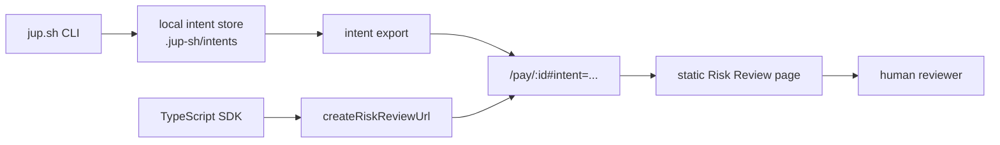
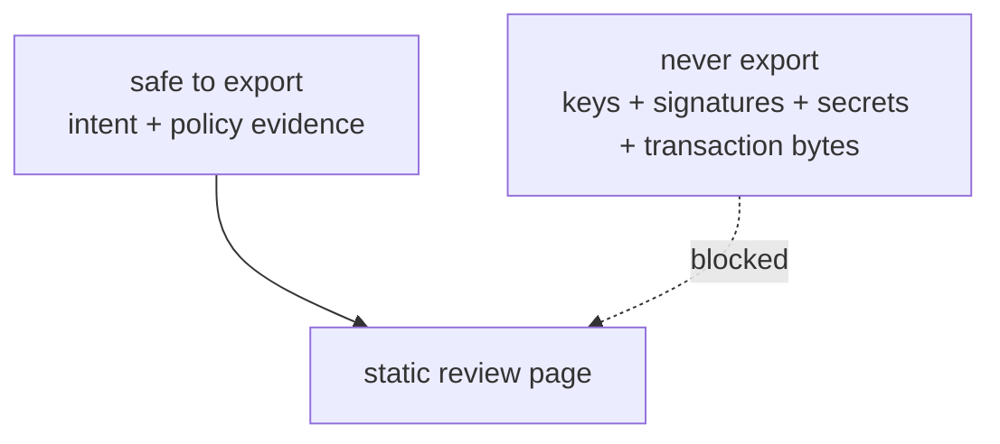

# Risk Review Export Design

Risk Review is the human fallback path.

The alpha does not have a backend intent API, so a saved local intent can be
exported into a hosted static review URL. This connects the CLI to the website
without adding accounts, auth, storage, or server deployment.

## Review Flow



The review page is not the primary payment flow. It appears only when policy
returns `review_required`.

## Export Command

The CLI saves local intents under:

```txt
.jup-sh/intents/<intent_id>.json
```

Export a saved intent:

```bash
jup-sh intent export intent_abc123
```

Output:

```txt
https://jup.sh/pay/intent_abc123#intent=<base64url-json-payload>
```

The website reads the `#intent=` fragment and renders the real intent data.

## SDK Helper

The SDK can generate the same URL format without a subprocess:

```ts
import {
  createPaymentIntent,
  createRiskReviewUrl,
} from "../sdk/index.js";

const intent = await createPaymentIntent({
  agent: "deepseek",
  token: "SOL",
  amount: 20,
  settle: "USDC",
});

const reviewUrl = createRiskReviewUrl(intent, {
  reviewBaseUrl: "https://www.jup.sh",
});
```

`createRiskReviewUrl` uses the same payload contract as `jup-sh intent export`.
`parseRiskReviewPayload` can decode the fragment back into a `PaymentIntent`
for tests and local tooling.

## Why URL Fragment

The current website is a static Cloudflare Pages app. It cannot read a user's
local `.jup-sh/intents` directory.

A URL fragment is the smallest useful bridge:

- no backend required;
- works with the current static app;
- keeps CLI and Risk Review connected;
- normal browser requests do not send fragments to the server;
- easy to replace later with a backend intent API.

## Payload Shape

The exported payload is:

```txt
base64url(JSON.stringify(PaymentIntent))
```

No padding is used.

Allowed payload fields:

- intent ID;
- agent name;
- payer token;
- recipient label or address;
- settlement amount and token;
- quote;
- status;
- decision;
- reasons;
- policy checks;
- review URL;
- created timestamp.

Forbidden payload fields:

- private keys;
- wallet signatures;
- unsigned transaction bytes;
- access tokens;
- API keys;
- sensitive customer data.

## Security Boundary



The fragment model is acceptable only because the alpha payload contains review
metadata, not signing material. It should not be used for sensitive customer
data or production payment authorization.

## Future Backend Path

When a backend exists, the URL fragment should be replaced by a durable intent
API:

```txt
POST /api/intents
GET  /api/intents/:id
GET  /pay/:id
```

At that point:

- `intent export` can upload or sync the local intent;
- the review URL can be short and shareable;
- payload access can be authenticated;
- approval/rejection can be persisted;
- status and receipts can be attached to the same intent.

Until then, fragment export is an MVP bridge, not the final review
architecture.
