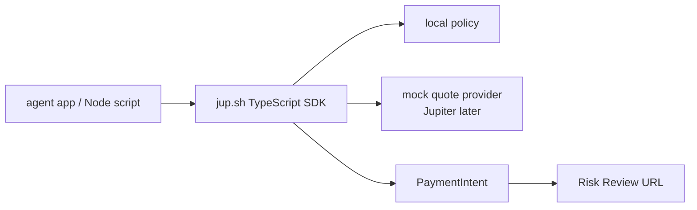
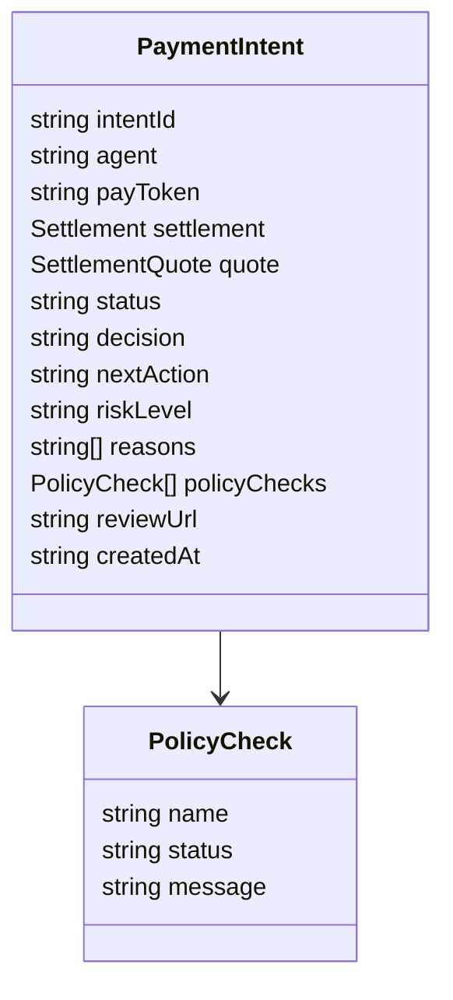
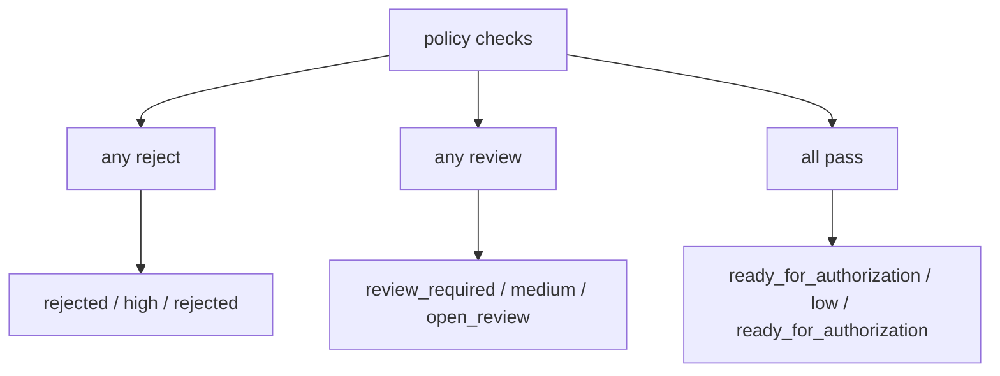

# SDK Technical Design

The SDK is the next interface after the CLI.

The CLI proves that an agent payment intent can be created from a command. The
SDK should make the same primitive usable from application code without
requiring a subprocess.

## Goal

The first SDK surface should feel like this:

```ts
import { createPaymentIntent } from "./sdk";

const intent = await createPaymentIntent({
  agent: "deepseek",
  token: "SOL",
  amount: 20,
  settle: "USDC",
});
```

The result should match the CLI JSON contract:

```txt
PaymentIntent + policyChecks + quote + decision + nextAction
```

The SDK does not sign transactions, execute swaps, custody funds, or call a
hosted backend in this phase.

## SDK Boundary



The first SDK is local and deterministic. It mirrors the CLI contract so that
apps can integrate before a backend exists.

## Public API

### createPaymentIntent

```ts
createPaymentIntent(input, options?): Promise<PaymentIntent>
```

Input:

```ts
type CreatePaymentIntentInput = {
  agent: string;
  token: string;
  amount: number;
  settle: "USDC" | string;
  recipient?: string;
  reference?: string;
};
```

Options:

```ts
type CreatePaymentIntentOptions = {
  policy?: Partial<Policy>;
  quoteProvider?: SettlementQuoter;
  reviewBaseUrl?: string;
};
```

The default quote provider is a mock provider. Jupiter-backed quotes should be
added behind the same `SettlementQuoter` boundary later.

### evaluatePolicy

```ts
evaluatePolicy(input, policy): PolicyResult
```

This exposes the deterministic policy engine for tests and custom integrations.

### createMockSettlementQuote

```ts
createMockSettlementQuote(input): SettlementQuote
```

This keeps local examples stable and avoids external dependencies.

## Data Contract

The SDK should reuse the same field names as the CLI JSON contract.



This is intentional. The SDK should not invent a second contract that differs
from the CLI.

## Decision Mapping



The mapping must remain aligned with the CLI:

| Decision | Status | Next action | Risk level |
| --- | --- | --- | --- |
| `auto_pay` | `ready_for_authorization` | `ready_for_authorization` | `low` |
| `review_required` | `review_required` | `open_review` | `medium` |
| `rejected` | `rejected` | `rejected` | `high` |

## Current Phase

The first SDK implementation should include:

- TypeScript types;
- default policy;
- local deterministic policy checks;
- mock settlement quote;
- `createPaymentIntent`;
- Node example;
- typecheck in the release gate.

It should not include:

- npm publishing;
- bundled build output;
- wallet signing;
- Solana transaction requests;
- Jupiter HTTP calls;
- hosted backend API calls.

## Future Phase

Once the local SDK surface is stable:

1. Add a Jupiter quote provider.
2. Add SDK docs and examples for Risk Review.
3. Decide whether npm package export should include CLI, SDK, or separate
   packages.
4. Add transaction request creation only after policy and quote behavior are
   stable.
